## Оглавление

- [Задание 1. Анализ и планирование](#задание-1-анализ-и-планирование)
- [Задание 2. Проектирование микросервисной архитектуры](#задание-2-проектирование-микросервисной-архитектуры)
- [Задание 3. Разработка ER-диаграммы](#задание-3-разработка-er-диаграммы)
- [Задание 4. Создание и документирование API](#задание-4-создание-и-документирование-api)
- [Задание 5. Работа с docker и docker-compose](#задание-5-работа-с-docker-и-docker-compose)

# Задание 1. Анализ и планирование

### 1. Описание функциональности монолитного приложения

**Управление отоплением:**

- Пользователь через веб-интерфейс удалённо включает и выключает отопление в своём доме.
- Команда из веб-клиента синхронным HTTP-запросом доходит до сервера, сервер так же синхронно отправляет команду на реле отопления, физически установленное в доме.
- Текущее состояние реле и параметры устройства хранятся в PostgreSQL, в единой таблице `sensors`.
- Подключение нового устройства возможно только при выезде сервисного инженера, самостоятельная регистрация пользователем не поддерживается.

**Мониторинг температуры:**

- Пользователь через веб-интерфейс смотрит текущую температуру по своему дому/комнате.
- Данные собираются по pull-модели: монолит сам инициирует HTTP-запрос к датчику и получает текущее значение в синхронном ответе — см. <a href="apps/smart_home/services/temperature_service.go" target="_blank" rel="noopener noreferrer">сервис</a>. Результат подмешивается в ответы `GET /api/v1/sensors` и `GET /api/v1/sensors/:id`.
- История значений и метаданные датчиков лежат в той же таблице `sensors`, без отдельного хранилища временных рядов.

### 2. Анализ архитектуры монолитного приложения

- **Язык и стек.** Go, веб-фреймворк Gin, HTTP-сервер на порту `8080`, REST API под префиксом `/api/v1`.
- **СУБД.** PostgreSQL, прямое подключение из приложения. Схема инициализируется скриптом <a href="apps/smart_home/init.sql" target="_blank" rel="noopener noreferrer"><code>apps/smart_home/init.sql</code></a> — одна таблица `sensors` со всеми типами устройств в одной плоскости.
- **Взаимодействие.** Только синхронное: веб-клиент ↔ монолит — REST/HTTPS; монолит ↔ датчики и реле — REST/HTTP. Никакой асинхронности, очередей, событий или подписок нет.
- **Развёртывание.** Один контейнер с приложением и контейнер PostgreSQL, поднимается через `docker-compose ` — см. <a href="apps/docker-compose.yml" target="_blank" rel="noopener noreferrer"><code>apps/docker-compose.yml</code></a>. Любой релиз требует пересборки и перезапуска всего сервиса.
- **Масштабирование.** По факту только вертикальное. Горизонтально нельзя поднять несколько копий из-за общего состояния и того, что реле/датчики жёстко связаны с одним сервером, который их опрашивает.
- **Текущая нагрузка.** 100 веб-клиентов, 100 модулей управления отоплением. Запас прочности у такой схемы заканчивается невелик.

### 3. Определение доменов и границы контекстов

В текущем монолите всё свалено в один контекст «Smart Home». В целевой системе разбиваю по уровням «Домен → Поддомен → Контекст». Smart Home Management — ядро бизнес-ценности компании; IAM, Commerce, Communications и Observability вынесены отдельными доменами, потому что обслуживают всю экосистему, а не только Smart Home (например, IAM нужен и Commerce, чтобы знать «кто оплатил»; Notifications нужны и Billing, чтобы слать чек).

<table>
  <thead>
    <tr><th>Домен</th><th>Поддомен</th><th>Контекст</th></tr>
  </thead>
  <tbody>
    <tr>
      <td rowspan="5"><b>Smart Home Management</b></td>
      <td><b>Devices</b></td>
      <td>каталог устройств и комплектов и работа с ними</td>
    </tr>
    <tr>
      <td><b>Climate</b></td>
      <td>управление отоплением · телеметрия температуры</td>
    </tr>
    <tr>
      <td><b>Lighting</b></td>
      <td>управление освещением</td>
    </tr>
    <tr>
      <td><b>Security</b></td>
      <td>видеонаблюдение · контроль доступа (замки, ворота)</td>
    </tr>
    <tr>
      <td><b>Automation</b></td>
      <td>конструктор сценариев · исполнение и оркестрация поддоменов</td>
    </tr>
    <tr>
      <td><b>Identity &amp; Access</b></td>
      <td><b>IAM</b></td>
      <td>аутентификация · авторизация · ролевая модель </td>
    </tr>
    <tr>
      <td><b>Commerce</b></td>
      <td><b>Billing</b></td>
      <td>подписки и тарифы · обработка платежей</td>
    </tr>
    <tr>
      <td><b>Communications</b></td>
      <td><b>Notifications</b></td>
      <td>маршрутизация по событию · доставка по каналам (email/SMS/push)</td>
    </tr>
    <tr>
      <td><b>Observability</b></td>
      <td><b>Analytics</b></td>
      <td>операционные дашборды для команды поддержки</td>
    </tr>
  </tbody>
</table>

Продуктовые поддомены Smart Home (`Devices`, `Climate`, `Lighting`, `Security`) устроены по одной схеме: каждый владеет своими сущностями, командами, телеметрией и пользовательской инфографикой «по своему дому за период» — отличаются только тем, какими устройствами оперируют. **Automation** выделен отдельно, потому что сценарии по природе кросс-поддоменные («ушёл из дома → выключить свет + поставить охрану + снизить отопление»); внутри продуктовых поддоменов держать общий движок правил пришлось бы дублировать.

**Аналитика — про разделение потребителей.** Внутри каждого продуктового поддомена живёт **пользовательский** модуль инфографики на собственных данных (история температур, события камер) — это часть BC и за его границы не выезжает. Top-level **Observability** — это **инструмент команды поддержки**: кросс-клиентская сводка, состояние парка устройств, диагностика жалоб. Разные потребители, разные объёмы данных и разные SLA, поэтому отделены.

### 4. Проблемы монолитного решения

- **Невозможно частичное масштабирование.** Поток телеметрии и поток управляющих команд растут по-разному, но в монолите масштабируются вместе.
- **Релиз требует простоя всей системы.** Любое изменение — пересборка одного бинарника и рестарт; на это время недоступны все функции, включая просмотр температуры и управление отоплением.
- **Сильная связность доменов.** Управление устройствами, телеметрия, сценарии и пользователи живут в одной кодовой базе и одной БД (одна таблица `sensors` для всего) — изменение в одном домене легко ломает соседний.
- **Жёсткая связь с одной СУБД.** PostgreSQL сейчас обслуживает и транзакционную часть (CRUD устройств, пользователи), и фактическую timeseries-нагрузку (телеметрия). Это неоптимально: для телеметрии лучше подходит специализированное хранилище.
- **Только синхронное взаимодействие.** Если датчик или реле недоступны — запрос пользователя или внутренняя логика повисают на таймауте; нет очередей команд, повторов и гарантированной доставки.
- **Pull-модель сбора телеметрии.** Сервер должен сам опрашивать каждое устройство — не масштабируется на сотни тысяч устройств в посёлках, увеличивает задержки и нагрузку на сеть.
- **Невозможно расширение по новым типам устройств без рефакторинга всего.** Каждый новый тип устройства/протокол партнёра — это код в общем монолите и его деплой; нет точки расширения для «ещё неизвестных» датчиков, заявленной в условиях.
- **Один язык (Go) для всех задач.** Где-то выгоднее Python (аналитика по телеметрии, ML-сценарии), где-то отдельный сервис на другом языке — выбора нет, всё делается в Go.
- **Слабая изоляция отказов.** Падение одного компонента (например, парсера телеметрии или клиента к внешнему API) валит всё приложение целиком.
- **Нет self-service-онбординга устройств.** Условие «пользователь сам подключает устройства» не выполнимо в текущем коде — там в принципе нет потока provisioning, всё делает инженер на выезде.
- **Не поддержана модель партнёров и комплектов.** Для продажи модульными комплектами и интеграции партнёрских устройств нужен отдельный домен `Devices` со своими процессами provisioning'а — сейчас его нет.

### 5. Визуализация контекста системы — диаграмма С4

Контекст целевой экосистемы.

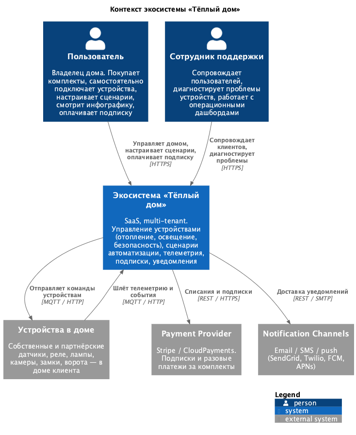

# Задание 2. Проектирование микросервисной архитектуры

### Диаграмма контейнеров (Containers)

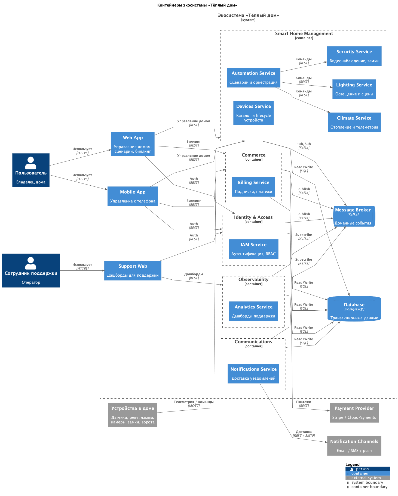

### Диаграммы компонентов (Components)

По одной диаграмме на каждый из 9 микросервисов.

#### Smart Home

**Devices**

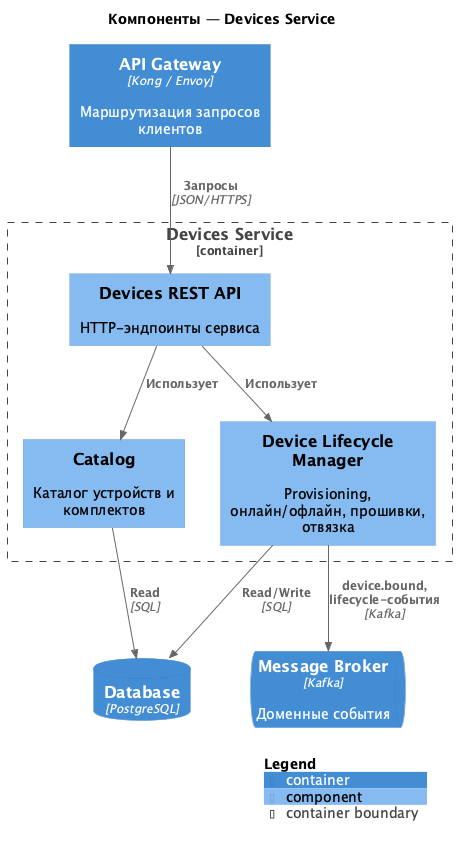

**Climate**

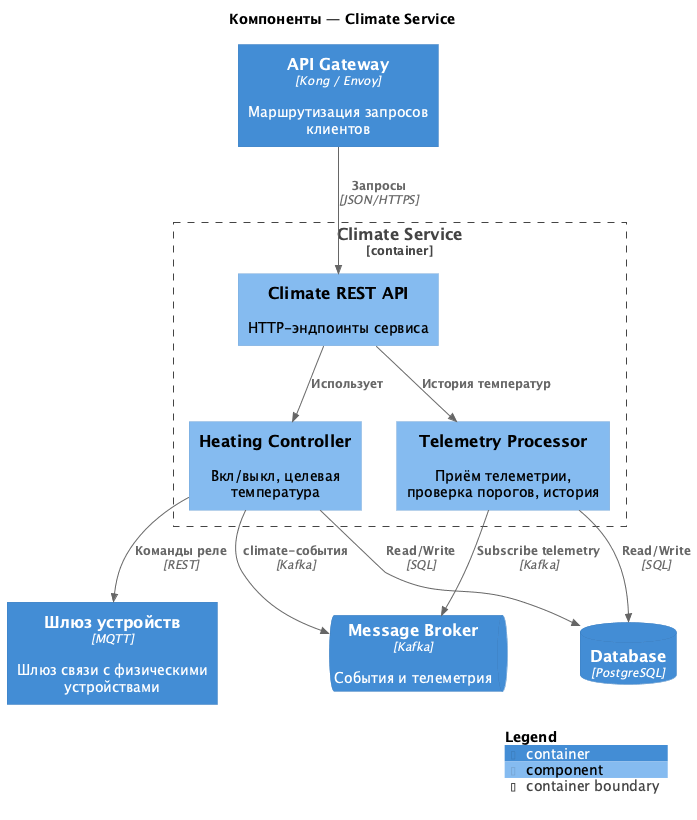

**Lighting**

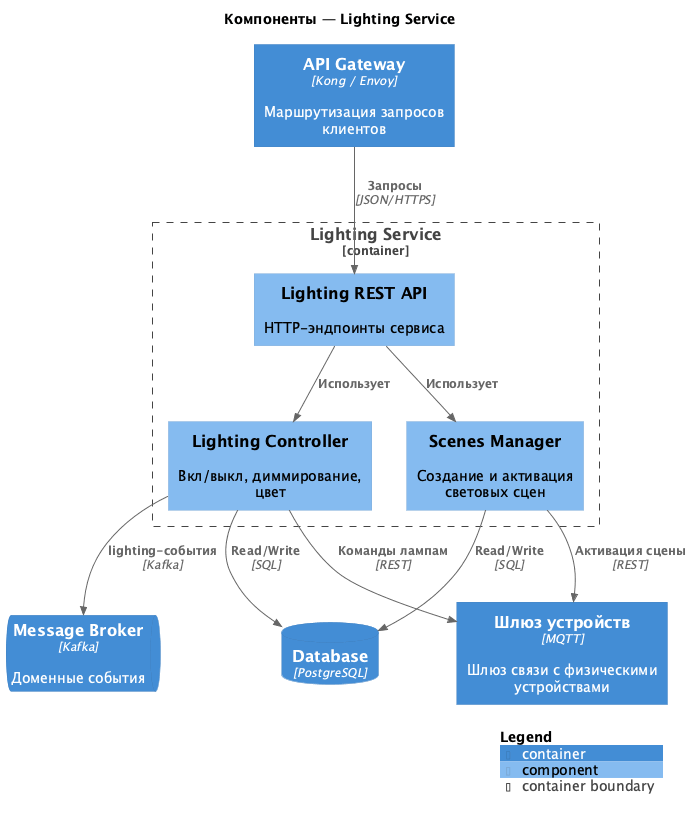

**Security**

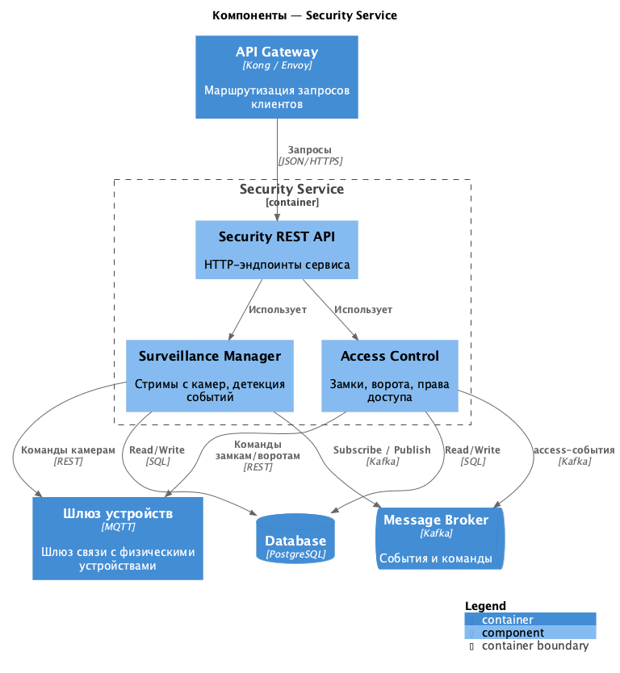

**Automation**

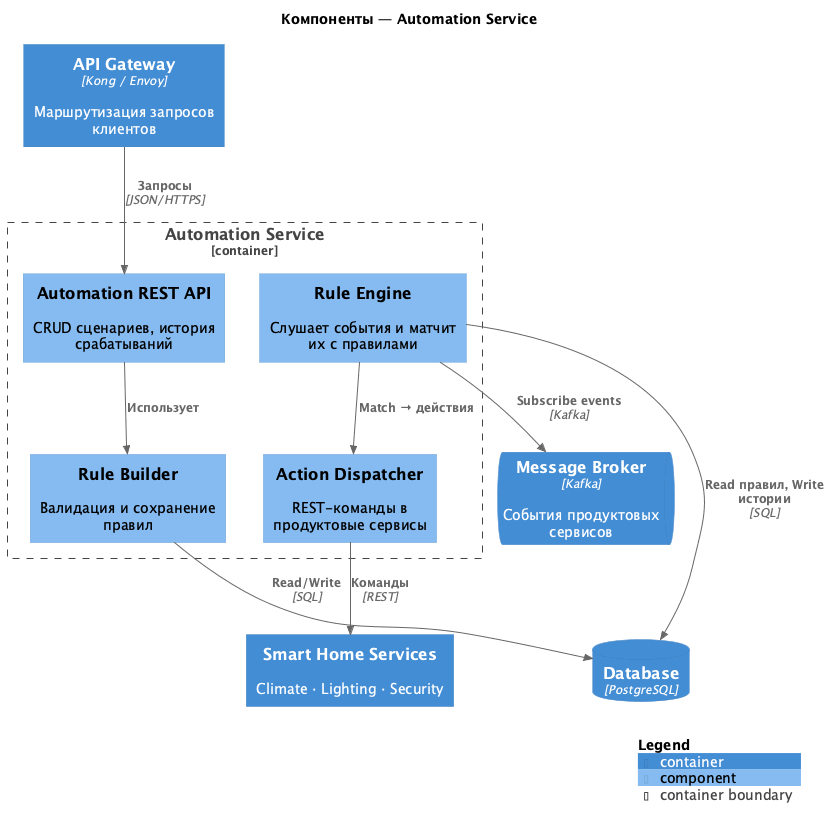

#### Cross-cutting

**IAM**

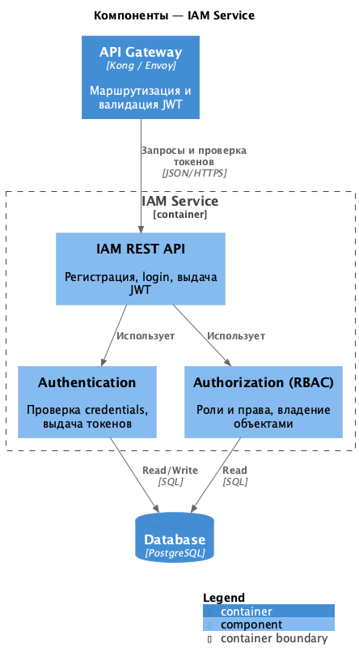

**Billing**

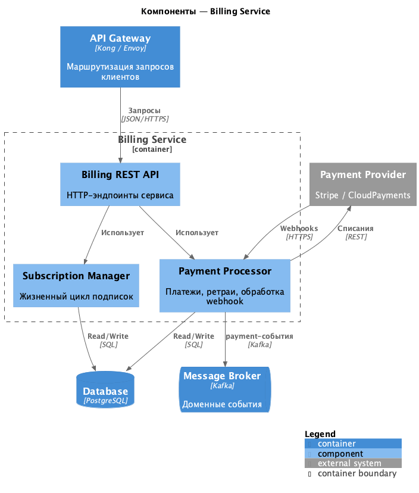

**Notifications**

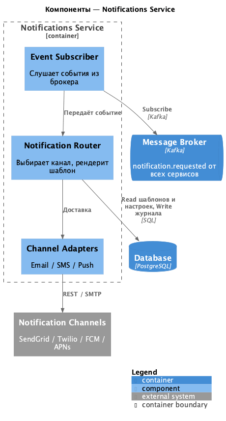

**Analytics**

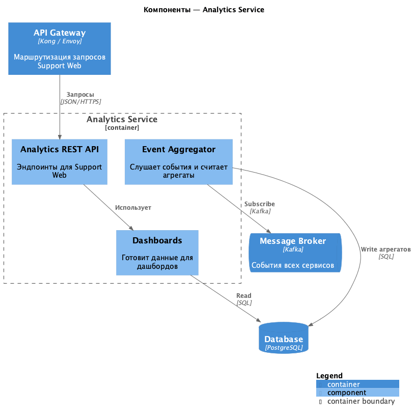

### Диаграммы кода (Code)

UML-диаграммы классов для самых критичных частей системы.

**Climate Service — управление устройствами отопления**

Иерархия устройств (`Device` → `HeatingDevice`), фасад уровня дома (`HouseClimateManager`) с операциями on/off, выставление температуры и сбор статистики по всем устройствам.

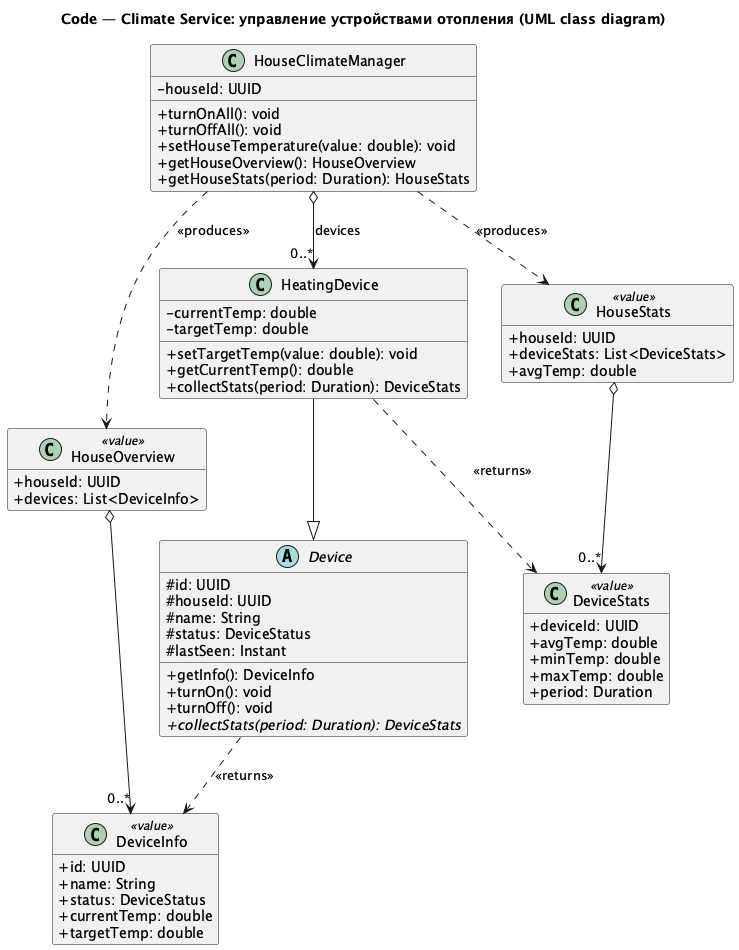

**Devices Service — provisioning и lifecycle устройств**

Регистрация устройства в реестре, изменение метаданных, online/offline-статус и decommission через фасад уровня дома (`HouseDeviceManager`).

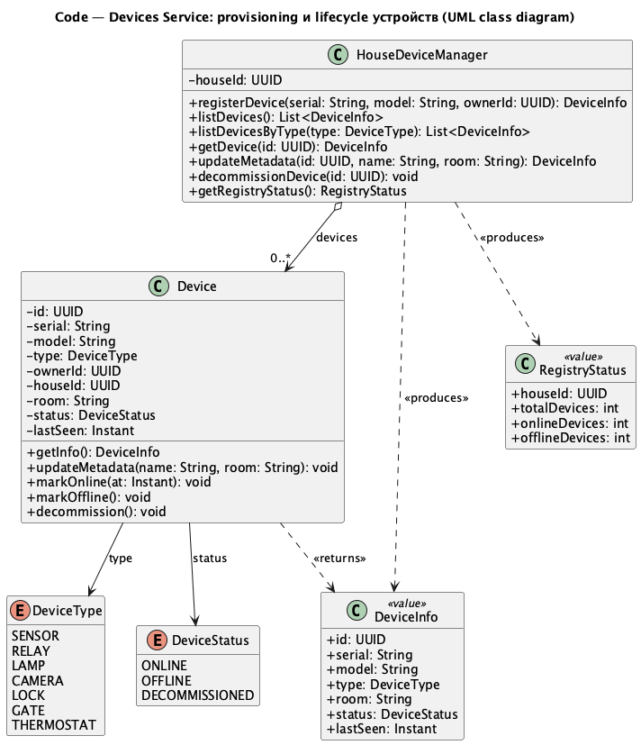

**Automation Service — управление сценариями**

CRUD сценариев, активация/деактивация, ручной запуск, история срабатываний; сценарий состоит из триггера и набора действий, действия дёргают публичные методы продуктовых сервисов.

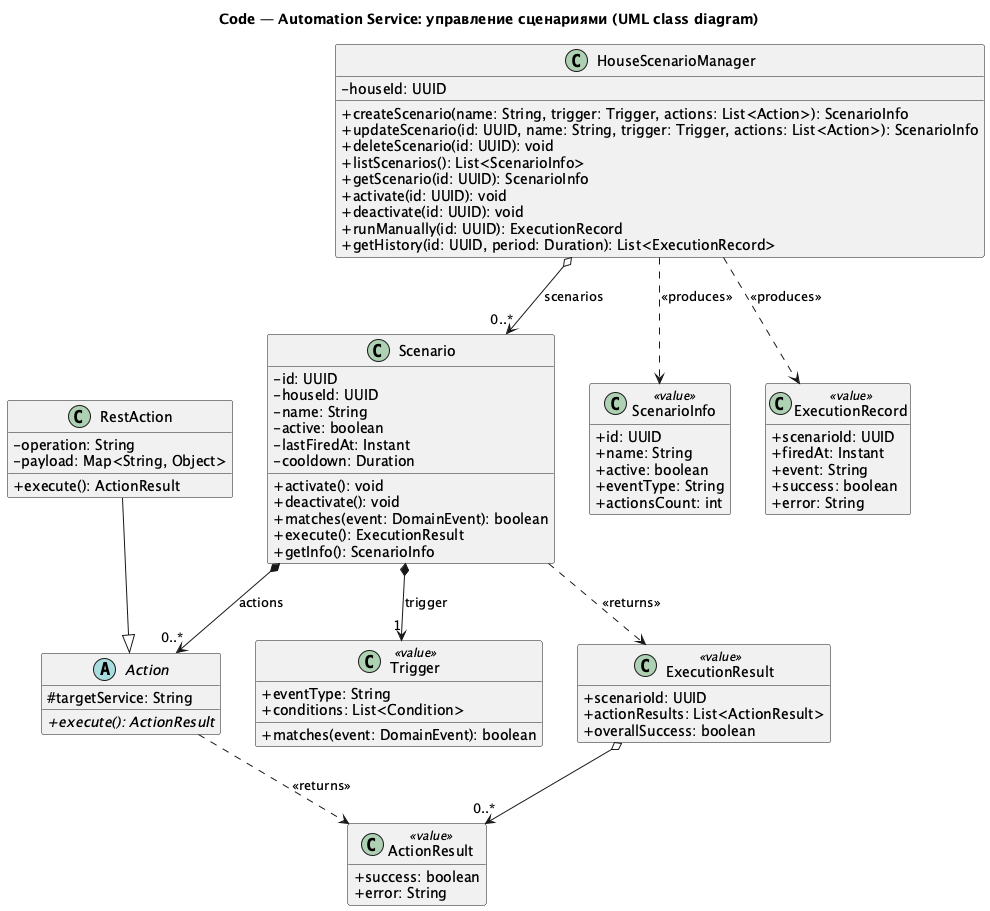

# Задание 3. Разработка ER-диаграммы

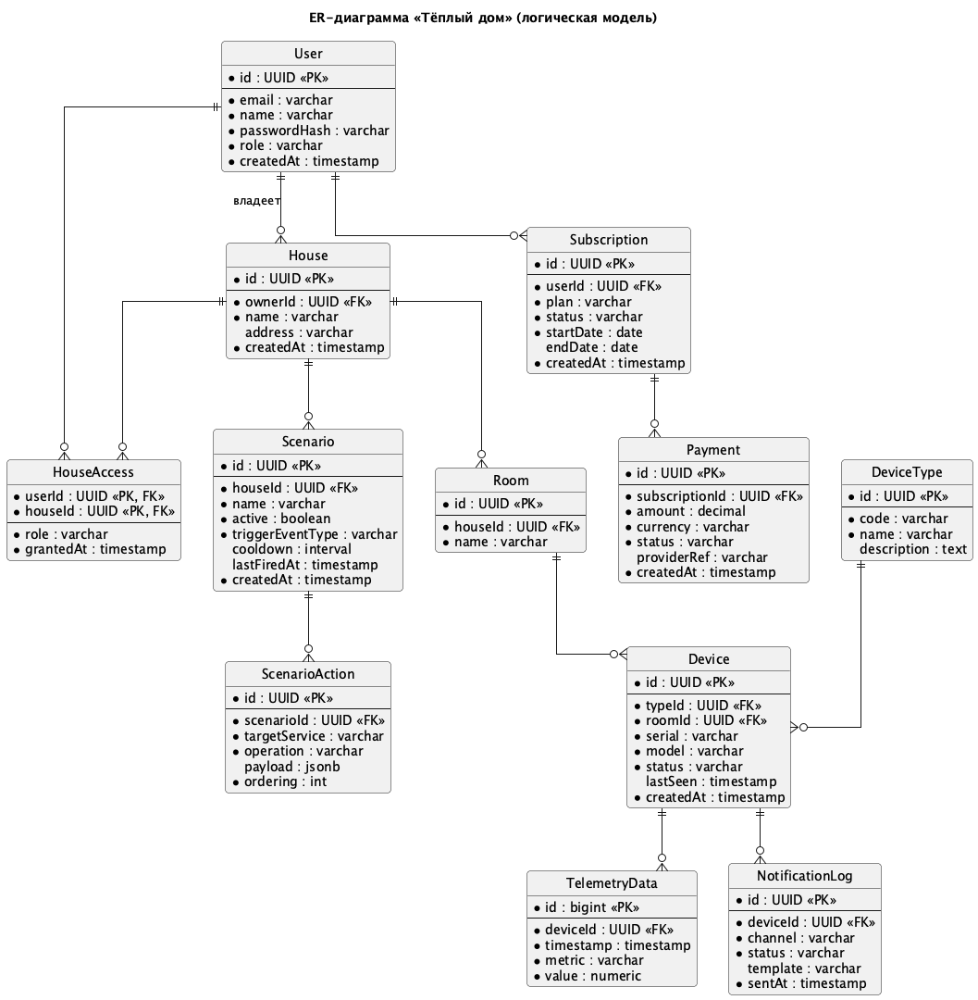

# Задание 4. Создание и документирование API

### 1. Тип API

Беру **гибридный подход — REST и AsyncAPI/Kafka**. Выбор для каждой связи диктуется тем, нужен ли вызывающей стороне немедленный ответ.

- **REST (OpenAPI 3.0)** — везде, где синхронный запрос-ответ. Это вся внешняя поверхность системы (Web/Mobile/Support Web → сервисы через API Gateway) и все межсервисные синхронные вызовы — например, Automation → Climate/Lighting/Security при исполнении сценария: dispatcher'у нужен HTTP-код, чтобы понять, доставлена ли команда. JSON over HTTPS, авторизация через JWT (`bearerAuth`) — единый формат, который понимают и фронт, и бэкенд.
- **AsyncAPI 2.6 поверх Kafka** — там, где взаимодействие по природе асинхронное:
  - **Поток телеметрии** от устройств (`climate.telemetry`) — десятки тысяч сообщений в секунду, синхронный REST тут не работает;
  - **Доменные события** между сервисами (`device.bound`, `billing.payment`, `security.access`) — продюсер не должен блокироваться на консьюмерах и не должен знать, кто вообще слушает;
  - **Запросы на уведомления** (`notification.requested`) — pub/sub-fan-out на Notifications Service, который полностью event-driven и REST не имеет (см. C4 Components).

Где какие протоколы — однозначно следует из C4: на диаграмме контейнеров Web/Mobile/Support Web ходят к сервисам по REST, физические устройства публикуют телеметрию через MQTT-шлюз в Kafka, а Smart Home / Cross-cutting сервисы делают pub/sub в общий Message Broker.

### 2. Документация API

- <a href="https://editor.swagger.io/?url=https://raw.githubusercontent.com/SiritosKon/architecture-warmhouse/warmhouse/docs/api/rest.yaml" target="_blank" rel="noopener noreferrer">REST — Swagger Editor</a>
- <a href="https://studio.asyncapi.com/?url=https://raw.githubusercontent.com/SiritosKon/architecture-warmhouse/warmhouse/docs/api/kafka.yaml" target="_blank" rel="noopener noreferrer">Kafka — AsyncAPI Studio</a>

# Задание 5. Работа с docker и docker-compose

<a href="apps/temperature-api/Dockerfile" target="_blank" rel="noopener noreferrer"><code>apps/temperature-api/Dockerfile</code></a>
